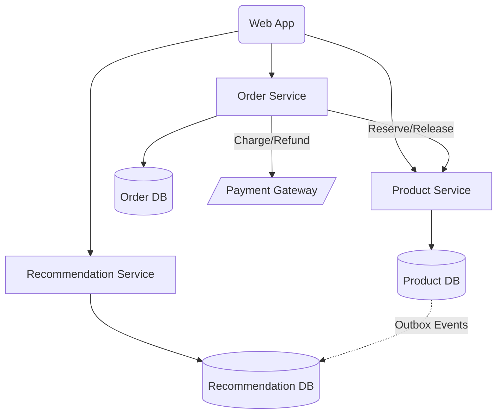

# Latency Aficionados

## Problem

Latency Aficionados is a retro video game marketplace where users can sell retro video games and can also buy such video games. The platform is capable of posting products, searching products, viewing product descriptions, rating products with reviews and comments, and also providing product recommendations to users based on previous browsing.

Our CTO, Mr. Fast, wants the smallest latencies possible. He cares deeply about how things render and how fast they render. Right now, the whole website is running on React 16. You need to find ways to speed up rendering and ensure rendering is fast at all times. Mr. Fast also has a monolith written in Java 1.4 that needs to be migrated to Java 25. You need to propose a decomposition of the monolith.

## Solution

Outbox Table
- Run deletes in batches
- Autovacuum tuned for this table
- Lower fillfactor

-- Local progress marker
recommendation_ingestion_state (
  last_processed_id BIGINT NOT NULL
);