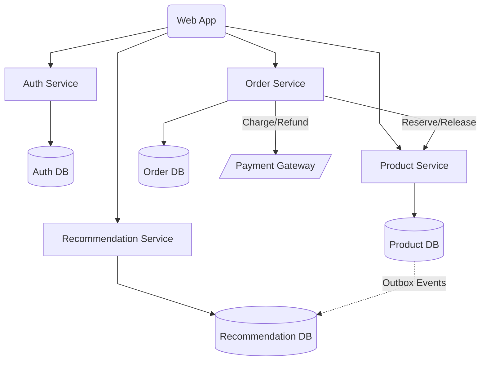

# Latency Aficionados

## 1. Problem Statement and Context

Latency Aficionados is a retro video game marketplace where users can sell retro video games and can also buy such video games. The platform is capable of posting products, searching products, viewing product descriptions, rating products with reviews and comments, and also providing product recommendations to users based on previous browsing.

Our CTO, Mr. Fast, wants the smallest latencies possible. He cares deeply about how things render and how fast they render. Right now, the whole website is running on React 16. You need to find ways to speed up rendering and ensure rendering is fast at all times. Mr. Fast also has a monolith written in Java 1.4 that needs to be migrated to Java 25. You need to propose a decomposition of the monolith.

## 2. Goals

1. **Low latency UX**: Fast rendering and fast responses for all user-facing interactions.
2. **Strong correctness for money and inventory**: Buying and selling operations must be strongly consistent, transactional, and auditable, ensuring correctness under concurrency and partial failures.
3. **Clear service boundaries**: Each service owns its data and business rules, avoiding shared databases and tight coupling between components.
4. **Incremental monolith decomposition**: Gradually migrate from the existing Java 1.4 monolith to the new services.
5. **Keep it simple, stupid**: Whenever possible, favor technologies and patterns that are easier to operate, debug, and reason about in production.

## 3. Non-Goals

1. **Single, shared database**: Services will not share databases or schemas, even if this would simplify some queries.
2. **Big-bang migration**: It's not our goal to migrate the code all at once.
3. **Over-engineering**: We should avoid premature optimization and operational complexity if not strictly necessary to meet our goals.

## 4. Principles

List in form of bullets what design principles you want to be followed, it's great to have 5-10 lines.
Example:
```
1. Low Coupling: We need to watch for coupling all times.
2. Flexibility: Users should be able to customize behavior without leaking the internals of the system. Leverage interfaces.
3. Observability: we should expose all key metrics on main features. Sucess and errors counters need to be exposed.
4. Testability: Chaos engineering is a must and property testing. Testing should be done by engineers all times.
5. Cache efficiency: Should leverage SSD caches and all forms of caches as much as possible.
```

## 5. Overall Diagrams

### 5.1. Overall Architecture



### 5.2. Deployment

### 5.3. Use Cases

## 6. Trade-offs

List the tradeoffs analysis, comparing pros and cons for each major decision.
Before you need list all your major decisions, them run tradeoffs on than.
example:
Major Decisions: 
```
1. One mobile code base - should be (...)
2. Reusable capability and low latency backends should be (...)
3. Cache efficiency therefore should do (...)
```
Tradeoffs:
```
1. React Native vs (Flutter and Native)
2. Serverless vs Microservices
3. Redis vs Enbeded Caches
```
Each tradeoff line need to be:
```
PROS (+) 
  * Benefit: Explanation that justify why the benefit is true.
CONS (+)
  * Problem: Explanation that justify why the problem is true.
```
PS: Be careful to not confuse problem with explanation. 
<BR/>Recommended reading: [Tradeoffs](http://diego-pacheco.blogspot.com/2023/07/tradeoffs.html)

## 7. For each key major component

What is a majore component? A service, a lambda, a important ui, a generalized approach for all uis, a generazid approach for computing a workload, etc...
```
6.1 - Class Diagram              : classic uml diagram with attributes and methods
6.2 - Contract Documentation     : Operations, Inputs and Outputs
6.3 - Persistence Model          : Diagrams, Table structure, partiotioning, main queries.
6.4 - Algorithms/Data Structures : Spesific algos that need to be used, along size with spesific data structures.
```

Exemplos of other components: Batch jobs, Events, 3rd Party Integrations, Streaming, ML Models, ChatBots, etc... 

Recommended Reading: [Internal system design forgotten](http://diego-pacheco.blogspot.com/2018/05/internal-system-design-forgotten.html)

## 8. Migrations

IF Migrations are required describe the migrations strategy with proper diagrams, text and tradeoffs.

## 9. Testing Strategy

Explain the techniques, principles, types of tests and will be performaned, and spesific details how to mock data, stress test it, spesific chaos goals and assumptions.

## 10. Observability Strategy

Explain the techniques, principles,types of observability that will be used, key metrics, what would be logged and how to design proper dashboards and alerts.

## 11. Data Store Designs

For each different kind of data store i.e (Postgres, Memcached, Elasticache, S3, Neo4J etc...) describe the schemas, what would be stored there and why, main queries, expectations on performance. Diagrams are welcome but you really need some dictionaries.

Outbox Table
- Run deletes in batches
- Autovacuum tuned for this table
- Lower fillfactor

-- Local progress marker
recommendation_ingestion_state (
  last_processed_id BIGINT NOT NULL
);

## 12. Technology Stack

Describe your stack, what databases would be used, what servers, what kind of components, mobile/ui approach, general architecture components, frameworks and libs to be used or not be used and why.

## 13. References

- [Postgres Full Text Search vs the rest](https://supabase.com/blog/postgres-full-text-search-vs-the-rest)
- [Postgres Full Text Search](https://gist.github.com/cpursley/e3586382c3a42c54ca7f5fef1665be7b)
- [Postgres Logical Replication](https://www.postgresql.org/docs/current/logical-replication.html)
- [TimescaleDB Jobs](https://www.tigerdata.com/docs/use-timescale/latest/jobs/create-and-manage-jobs)
- [TimescaleDB Retention Policy](https://www.tigerdata.com/docs/use-timescale/latest/data-retention/create-a-retention-policy)
- [TimescaleDB Continuous Aggregates](https://www.tigerdata.com/docs/use-timescale/latest/continuous-aggregates)
- [pg_cron](https://github.com/citusdata/pg_cron)