# Latency Aficionados

## 1. Problem Statement and Context

Latency Aficionados is a retro video game marketplace where users can sell retro video games and can also buy such video games. The platform is capable of posting products, searching products, viewing product descriptions, rating products with reviews and comments, and also providing product recommendations to users based on previous browsing.

Our CTO, Mr. Fast, wants the smallest latencies possible. He cares deeply about how things render and how fast they render. Right now, the whole website is running on React 16. You need to find ways to speed up rendering and ensure rendering is fast at all times. Mr. Fast also has a monolith written in Java 1.4 that needs to be migrated to Java 25. You need to propose a decomposition of the monolith.

## 2. Goals

1. **Low latency UX**: Fast rendering and fast responses for all user-facing interactions.
2. **Strong correctness for money and inventory**: Buying and selling operations must be strongly consistent, transactional, and auditable, ensuring correctness under concurrency and partial failures.
3. **Clear service boundaries**: Each service owns its data and business rules, avoiding shared databases and tight coupling between components.
4. **Incremental monolith decomposition**: Gradually migrate from the existing Java 1.4 monolith to the new services.
5. **Simplicity over complexity**: Whenever possible, favor technologies and patterns that are easier to operate, debug, and reason about in production.

## 3. Non-Goals

1. **Single, shared database**: Services will not share databases or schemas, even if this would simplify some queries.
2. **Big-bang migration**: It's not our goal to migrate the code all at once.
3. **Over-engineering**: We should avoid premature optimization and operational complexity if not strictly necessary to meet our goals.

## 4. Principles

1. **KISS (Keep It Simple, Stupid)**: Strive for the simplest solution that meets the requirements.
2. **YAGNI (You Aren't Going to Need It)**: Don't add more components to the architecture, unless you have to.
3. **Modularity**: The system should be composed of well-defined, loosely coupled modules.
4. **Correctness**: The system should be correct, consistent, and free of bugs.

## 5. Overall Diagrams

### 5.1. Overall Architecture


### 5.2. Deployment


### 5.3. Use Cases

```mermaid
flowchart LR
  s((👤 Seller))
  b((👤 Buyer))

  su([Sign up])
  li([Log in])

  s --- su --- b
  s --- li --- b

  s --- ap([Add product])
  s --- ep([Edit product])
  s --- rp([Remove product])

  b --- vpc([View product catalog])
  b --- sfp([Search for products])
  b --- vr([View recommendations])
  b --- vpd([View product details])
  b --- bp([Buy product])
  b --- rp2([Rate product])
```



## 6. Trade-offs

1. Postgres FTS vs. Elasticsearch
2. Logical Replication vs. Debezium
3. ECS vs. EKS

TODO

## 7. For each major component

TODO

What is a major component? A service, a lambda, an important UI, a generalized approach for all UIs, a generalized approach for computing a workload, etc.

```
6.1 - Class Diagram              : classic uml diagram with attributes and methods
6.2 - Contract Documentation     : Operations, Inputs and Outputs
6.3 - Persistence Model          : Diagrams, Table structure, partiotioning, main queries.
6.4 - Algorithms/Data Structures : Spesific algos that need to be used, along size with spesific data structures.
```

Exemples of other components: Batch jobs, Events, 3rd Party Integrations, Streaming, ML Models, ChatBots, etc.

## 8. Migrations

TODO

IF Migrations are required describe the migrations strategy with proper diagrams, text and tradeoffs.

## 9. Testing Strategy

TODO

Explain the techniques, principles, types of tests and will be performaned, and spesific details how to mock data, stress test it, spesific chaos goals and assumptions.

## 10. Observability Strategy

TODO

Explain the techniques, principles,types of observability that will be used, key metrics, what would be logged and how to design proper dashboards and alerts.

## 11. Data Store Designs

### 11.1. Auth DB

**Table 1: user**

| Key type | Column             | Type        | Description             |
| -------- | ------------------ | ----------- | ----------------------- |
| PK       | user_email         | text        | The user email address. |
|          | user_creation_date | timestamptz | The user creation date. |

**Table 2: user_credential**

| Key type | Column         | Type        | Description                         |
| -------- | -------------- | ----------- | ----------------------------------- |
| PK, FK   | user_email     | text        | The user email address.             |
|          | password_hash  | text        | The password hash.                  |
|          | salt           | text        | The salt used to hash the password. |
|          | pw_update_date | timestamptz | The last password update date.      |

**Table 3: refresh_token**

| Key type | Column                | Type        | Description                        |
| -------- | --------------------- | ----------- | ---------------------------------- |
| PK       | token_hash            | text        | The refresh token hash.            |
| FK       | user_email            | text        | The user email address.            |
|          | token_creation_time   | timestamptz | The refresh token creation time.   |
|          | token_expiration_time | timestamptz | The refresh token expiration time. |

**Table 4: role**

| Key type | Column             | Type        | Description             |
| -------- | ------------------ | ----------- | ----------------------- |
| PK       | role               | text        | The role name.          |
|          | role_creation_date | timestamptz | The role creation date. |

**Table 5: user_role**

| Key type | Column                  | Type        | Description                  |
| -------- | ----------------------- | ----------- | ---------------------------- |
| PK, FK   | user_email              | text        | The user email address.      |
| PK, FK   | role                    | text        | The role name.               |
|          | user_role_creation_date | timestamptz | The user role creation date. |

### 11.2. Product DB

**Table 1: seller**

| Key type | Column                   | Type        | Description                                          |
| -------- | ------------------------ | ----------- | ---------------------------------------------------- |
| PK       | seller_tax_id            | text        | The seller tax ID (e.g., SSN, ITIN, or EIN).         |
|          | legal_name               | text        | The legal name of the company or individual seller.  |
|          | display_name             | text        | How the seller name will be displayed in the system. |
|          | seller_registration_date | timestamptz | The date the seller registered in the system.        |

**Table 2: product_offer**

| Key type | Column              | Type           | Description                                   |
| -------- | ------------------- | -------------- | --------------------------------------------- |
| PK, FK   | seller_tax_id       | text           | The seller tax ID (e.g., SSN, ITIN, or EIN).  |
| PK       | product_sku         | text           | The product SKU (Stock Keeping Unit).         |
|          | product_name        | text           | The product name.                             |
|          | product_description | text           | The product description.                      |
|          | price               | numeric(10, 2) | The product unit price in USD.                |
|          | quantity_in_stock   | integer        | The number of units of this product in stock. |
|          | offer_creation_date | timestamptz    | The date the product offer was created.       |
|          | offer_update_date   | timestamptz    | The last time the offer was updated.          |

**Table 5: outbox_event**

Outbox Table
- Run deletes in batches
- Autovacuum tuned for this table
- Lower fillfactor

-- Local progress marker
recommendation_ingestion_state (
  last_processed_id BIGINT NOT NULL
);

### 11.3. Order DB

### 11.4. Recommendation DB

## 12. Technology Stack

- Web App: TypeScript 5 + React 19
- Auth Service: Java 25 + Spring Boot 4
- Auth DB: Postgres 18
- Product Service: Java 25 + Spring Boot 4
- Product DB: Postgres 18
- Order Service: Java 25 + Spring Boot 4
- Order DB: Postgres 18
- Recommendation Service: Java 25 + Spring Boot 4
- Recommendation DB: TimescaleDB
- Payment Gateway: Stripe

## 13. References

- [Postgres FTS vs. the rest](https://supabase.com/blog/postgres-full-text-search-vs-the-rest)
- [Postgres FTS](https://gist.github.com/cpursley/e3586382c3a42c54ca7f5fef1665be7b)
- [Postgres FTS: Fast when done right (debunking the slow myth)](https://news.ycombinator.com/item?id=43627646)
- [Postgres FTS: A search engine in a database](https://www.crunchydata.com/blog/postgres-full-text-search-a-search-engine-in-a-database)
- [Postgres Logical Replication](https://www.postgresql.org/docs/current/logical-replication.html)
- [TimescaleDB Jobs](https://www.tigerdata.com/docs/use-timescale/latest/jobs/create-and-manage-jobs)
- [TimescaleDB Retention Policy](https://www.tigerdata.com/docs/use-timescale/latest/data-retention/create-a-retention-policy)
- [TimescaleDB Continuous Aggregates](https://www.tigerdata.com/docs/use-timescale/latest/continuous-aggregates)
- [TimescaleDB on AWS](https://www.tigerdata.com/blog/recommendations-for-setting-up-your-architecture-with-aws-timescaledb)
- [pg_cron](https://github.com/citusdata/pg_cron)